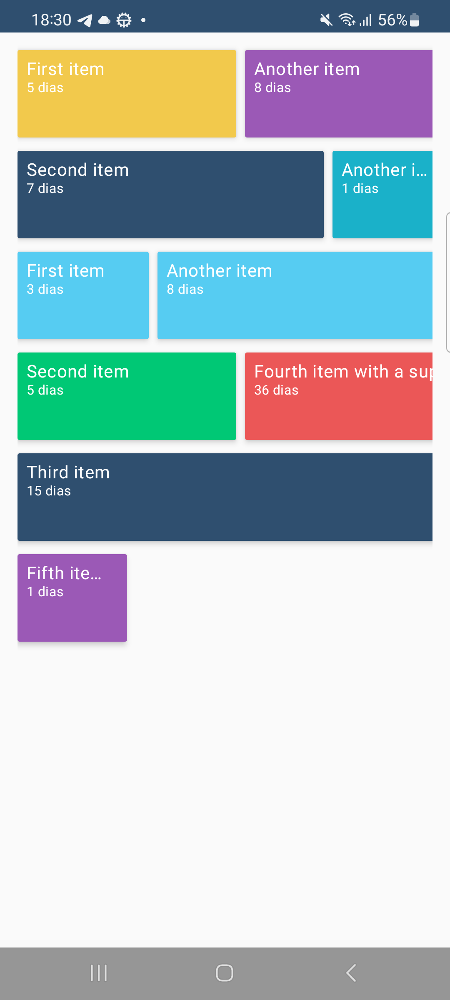
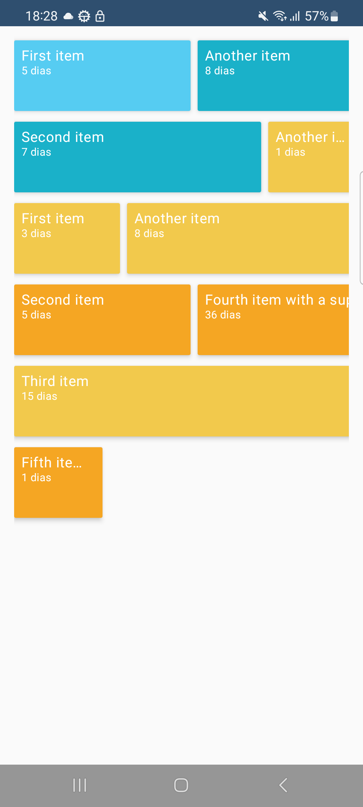
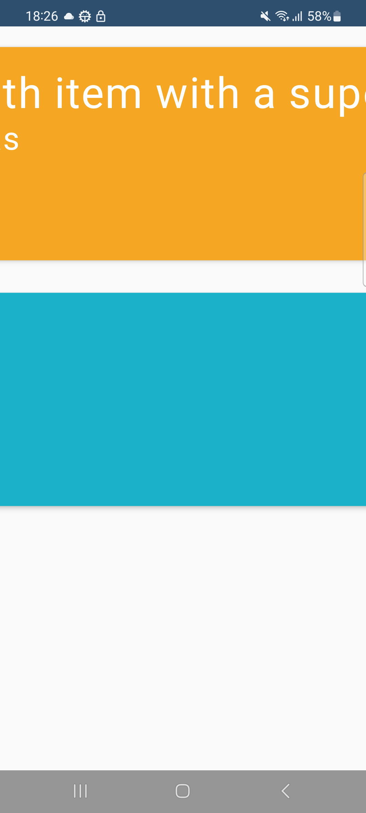
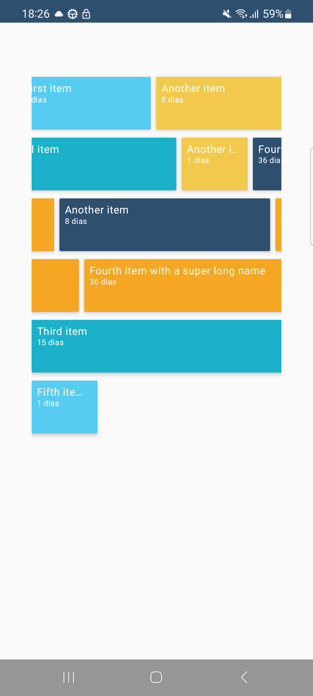

# Timeline App - README

## How long you spent on the assignment

I spent 4 hours completing this challenge, focusing on designing a clean and maintainable timeline
visualization.

## What you like about your implementation

- **Architecture:** I liked working with a modular architecture following Clean Architecture
  principles combined with an MVI pattern, which provides clear separation of concerns and good
  testability. The timeline arranges events in compact lanes with sizes proportional to event
  duration. The UI supports zooming for a better user experience. This architecture is well-suited
  for working with Compose.
- **Navigation:** I created a centralized navigation scheme to facilitate managing and finding all
  screens.
- **Dependency Injection:** I chose Hilt because it is officially supported by Google, easy to set
  up, and performs well due to code generation.
- **Testing** I used MockK as the mocking framework for unit tests. MockK is a modern and powerful
  Kotlin library that simplifies creating clear and effective mocks, especially useful for testing
  coroutines and interface-based dependencies.  
  This choice enabled isolated testing of the repository, use case, and view model layers, ensuring
  the application logic works correctly without

## What you would change if you were to do it again

- I would remove the data mocks and integrate with a backend, leaving the frontend responsible only
  for handling requests and displaying results, improving the app’s security.
- Add new features.
- Improve the layout and arrangement of items on the screen for a better visual experience.

## How you made your design decisions

I based my design on common timeline implementations and best practices in Android development,
aiming for simplicity, readability, and modularity. The color palette was inspired by Airtable's brand colors to give the app a vibrant and consistent look.

## How you would test this if you had more time

- Add more unit tests.
- Add instrumented tests.
- Increase code coverage to around 80% or more.

## Any special instructions on how to build/run your app

- Requires Android API level 24 or higher.

## Screenshots

### Basic Timeline

### Timeline with Random Colors

### Zoom In

### Zoom Out

